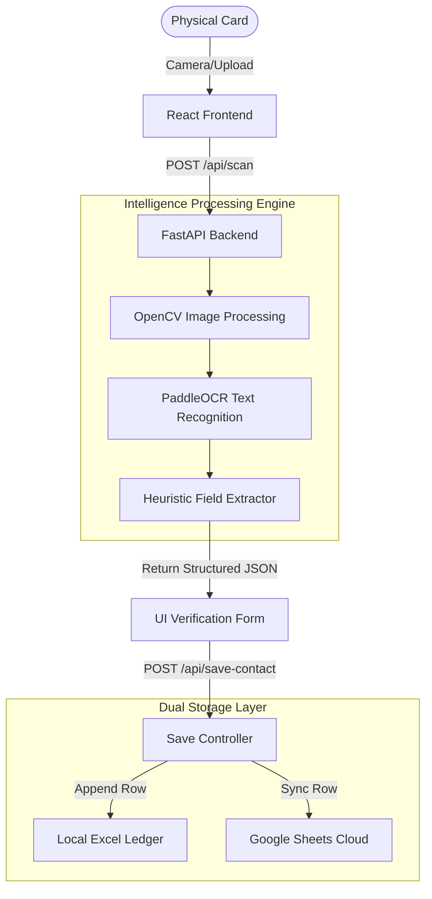

# CardSnap AI — Futuristic Business Card Scanning & Contact Intelligence

> **Automating data extraction to free business owners from the tedious grind of manual entry.**

CardSnap is a sleek, modern, full-stack web application designed to scan physical business cards, extract structured contact information, and store it seamlessly in Excel and Google Sheets. 

---

## 👨‍💼 The Origin Story: Automating for Prafhul Gupta

Like many traditional businessmen, my father, **Prafhul Gupta**, spent countless hours manually transcribing client details, phone numbers, and emails from stacks of physical business cards into massive Excel spreadsheets. It was a repetitive, error-prone, and exhausting process. 

CardSnap was built to solve this exact problem. By automating OCR text extraction, applying fuzzy duplicate resolution, and writing directly to local Excel ledgers with 1-click downloads, CardSnap turns a 5-minute typing task into a 5-second scan. It is built to make networking and lead management effortless for business owners.

---

## 🌟 Key Features & Intelligence Suite

*   **⚡ Instant AI Scanner & OCR:** Capture live images from your browser camera or upload image files (JPG, PNG, WEBP). Applies CLAHE contrast enhancement and noise reduction before extracting text using OCR.
*   **🗺️ Geographic Map Matrix:** Pinpoint contact locations on an interactive 3D map workspace. Integrates fallback geocoding to resolve complex business card addresses to physical lat/long coordinates.
*   **🔮 Smart Merge & Duplicate Radar:** Scans your database pairwise. Matches contacts based on exact email, exact phone, or fuzzy name similarity ratios (using SequenceMatcher thresholds >= 0.85). Displays a merge conflict UI where you can choose which details to save.
*   **📁 Ledger Archives & Switcher:** Manage multiple sheet profiles (e.g., *Client Ledger*, *Event Contacts*, *Vendor List*). Create, rename, delete, and hot-swap between multiple active `.xlsx` ledger sheets dynamically.
*   **💾 Multi-Channel Storage:** Appends saved entries to your active local Excel spreadsheet with optional real-time cloud backup to Google Sheets.

---

## 🛠 Tech Stack

| Component | Technology | Role |
| :--- | :--- | :--- |
| **Frontend** | React 19, Vite, Tailwind CSS v4, Lucide Icons | Premium glassmorphism HUD interface, map renders, and data flows. |
| **Backend** | Python 3.13, FastAPI, Uvicorn | Lightweight API routers, OCR image processing, and ledger storage. |
| **OCR & Vision** | OpenCV, Pillow, PaddleOCR / EasyOCR | Card image cleaning, thresholding, and character recognition. |
| **Storage Engine**| OpenPyXL, Google Sheets API | Excel writing and cloud synchronization. |

---

## 🏗 System Architecture



---

## 🚀 Quick Start & Local Setup

### Prerequisites
*   **Node.js**: v18+ (Recommended v20+)
*   **Python**: v3.10+

---

### 1-Click Launch (Windows Only)
Double-click the launcher script in the root directory:
```bash
./run-project.bat
```
This automatically spins up the FastAPI backend on `http://localhost:8000` and the React frontend on `http://localhost:5173`.

---

### Manual Launch

#### A. Backend Setup
1. Navigate to the backend folder:
   ```bash
   cd backend
   ```
2. Create and activate a Python virtual environment:
   ```bash
   python -m venv venv
   # Windows:
   venv\Scripts\activate
   # macOS/Linux:
   source venv/bin/activate
   ```
3. Install the dependencies:
   ```bash
   pip install -r requirements.txt
   ```
4. Start the FastAPI server:
   ```bash
   uvicorn main:app --reload --port 8000
   ```

#### B. Frontend Setup
1. Navigate to the frontend folder:
   ```bash
   cd frontend
   ```
2. Install Node packages:
   ```bash
   npm install
   ```
3. Start the development server:
   ```bash
   npm run dev
   ```

Open **`http://localhost:5173`** in your browser.

---

## 📝 Ledger Spreadsheet Format

When a contact is saved, CardSnap formats headers and appends data to the current active sheet:

| Name | Job Title | Company | Phone | Email | Website | LinkedIn | Address | Notes | Date Added |
| :--- | :--- | :--- | :--- | :--- | :--- | :--- | :--- | :--- | :--- |
| Prafhul Gupta | Businessman | PG Enterprises | +91 92205 09397 | info@pgent.com | www.pgent.com | - | Sector 87, Industrial Area, Faridabad | Father / Lead Inspirer | 16/08/2026 |

*   **Append-Only:** New scans append to the next available row. Previous entries are never lost.
*   **Export:** Click the **Excel Ledger** button in the dashboard to immediately download your current spreadsheet file.
