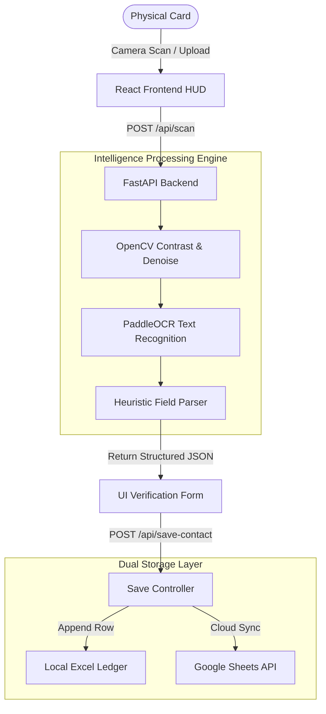

# 🎴 CardSnap AI — Futuristic Business Card Scanner & Contact Intelligence

<p align="center">
  
  
  
  
</p>

> **Empowering business owners by turning stacks of physical business cards into clean, organized contact databases instantly.**

---

## 👨‍💼 The Origin Story: Automating for Prafhul Gupta

> [!NOTE]
> **CardSnap was inspired by a real-world business need.**
> My father, **Prafhul Gupta**, is a businessman who frequently returns from conferences with stacks of physical business cards. Historically, he had to sit down and manually type every name, phone number, email, and address into Excel spreadsheets—a tedious, slow, and exhausting chore.
> 
> This application was built to automate that entire process. By replacing hours of manual entry with a 5-second scanner, CardSnap handles OCR, cleans formatting, resolves duplicates, and updates Excel sheets automatically, giving business owners their time back.

---

## 🚀 Key Features

*   **⚡ Holographic Scanner HUD:** Upload card images or capture them live using your browser's webcam. Features an interactive cyberpunk review overlay.
*   **🔮 Duplicate Radar & Smart Merge:** Scans database records pairwise. Matches duplicates by phone, email, or fuzzy name similarity (using sequence matching ratios >= 0.85) and guides you through conflict resolution.
*   **🗺️ Geo-Matrix Map:** Renders contacts on an interactive global 3D map. Features a fallback geocoding engine to automatically locate complex addresses.
*   **📁 Ledger Archives & Switcher:** Manage separate spreadsheets (e.g., *Clients*, *Vendors*, *Conventions*) and hot-swap active databases dynamically from the UI.
*   **💾 Local-First Spreadsheet Storage:** Appends all entries continuously to your active local Excel (`.xlsx`) sheet. Features 1-click downloads.
*   **☁️ Google Sheets Integration:** Automatically back up local Excel records to a cloud spreadsheet in real-time.

---

## 🛠 Tech Stack

```
   FRONTEND                     BACKEND                     OCR & VISION
┌──────────────┐             ┌──────────────┐             ┌──────────────┐
│ React 19     │             │ FastAPI      │             │ OpenCV       │
│ Vite         │    ◀───▶    │ Python 3.13  │    ◀───▶    │ PaddleOCR    │
│ Tailwind v4  │             │ OpenPyXL     │             │ EasyOCR      │
└──────────────┘             └──────────────┘             └──────────────┘
```

---

## 🏗 System Architecture



---

## ⚡ Quick Start & Local Setup

### 1. 1-Click Launch (Windows)
Simply double-click the launcher script in the root directory:
```bash
./run-project.bat
```
*This automatically launches the FastAPI backend (`http://localhost:8000`) and React frontend (`http://localhost:5173`).*

---

### 2. Manual Installation

> [!IMPORTANT]
> Make sure you have **Node.js v18+** and **Python v3.10+** installed on your system.

#### A. Backend Setup
```bash
cd backend
python -m venv venv

# Activate Virtual Environment:
# Windows:
venv\Scripts\activate
# macOS/Linux:
source venv/bin/activate

pip install -r requirements.txt
uvicorn main:app --reload --port 8000
```

#### B. Frontend Setup
```bash
cd frontend
npm install
npm run dev
```
Now navigate to **`http://localhost:5173`** in your browser.

---

## 📝 Active Ledger Format (Example Sheet)

When a contact is saved, CardSnap formats headers and appends data to the active sheet like this:

| Name | Job Title | Company | Phone | Email | Website | LinkedIn | Address | Notes | Date Added |
| :--- | :--- | :--- | :--- | :--- | :--- | :--- | :--- | :--- | :--- |
| Aarav Mehta | Technology Director | Apex Solutions | +91 98765 43210 | aarav@apexsolutions.com | www.apexsolutions.com | linkedin.com/in/aaravm | Sector 62, Noida, UP | Met at annual tech summit | 16/08/2026 |
| Priya Sharma | Head of Operations | Zen Logistics | +91 91234 56789 | priya@zenlogistics.in | www.zenlogistics.in | - | Okhla Phase 3, New Delhi | Key lead for Delhi routes | 16/08/2026 |

*   **Append-Only:** New entries are added to the bottom of the table. Previously stored contacts are never overwritten.
*   **Export:** Click the **Excel Ledger** button in the dashboard to immediately download your current spreadsheet file.
